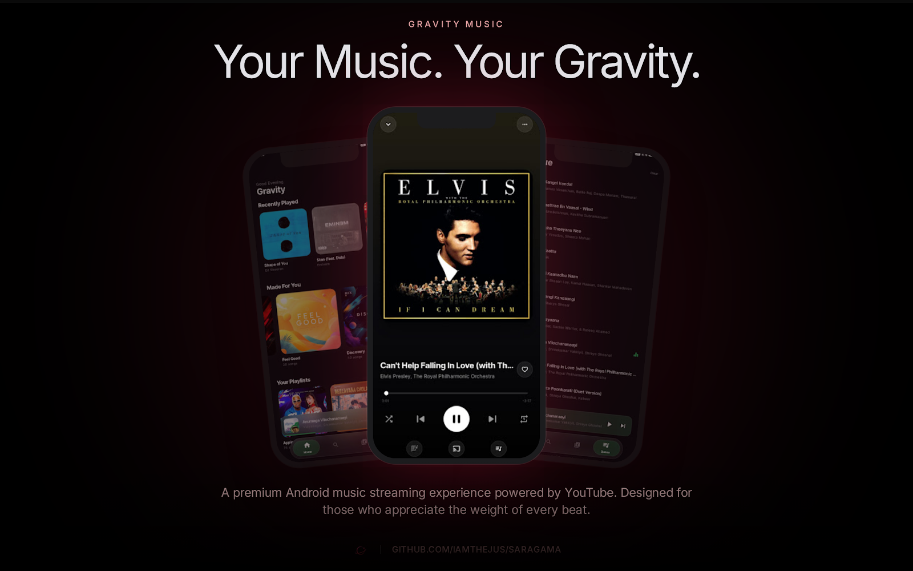
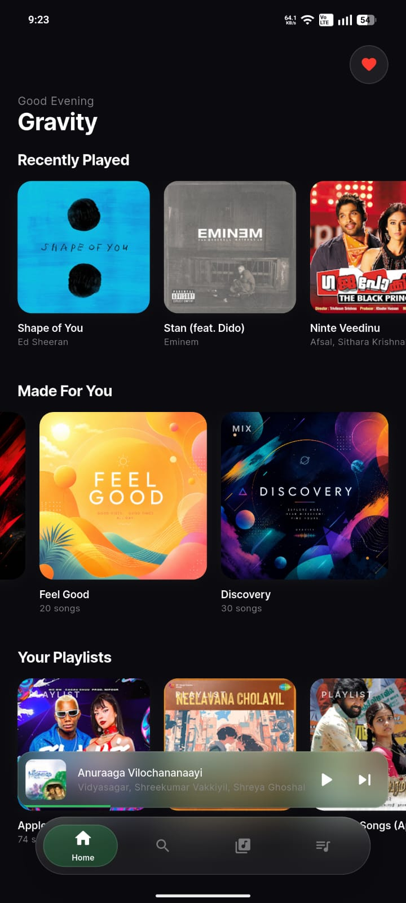
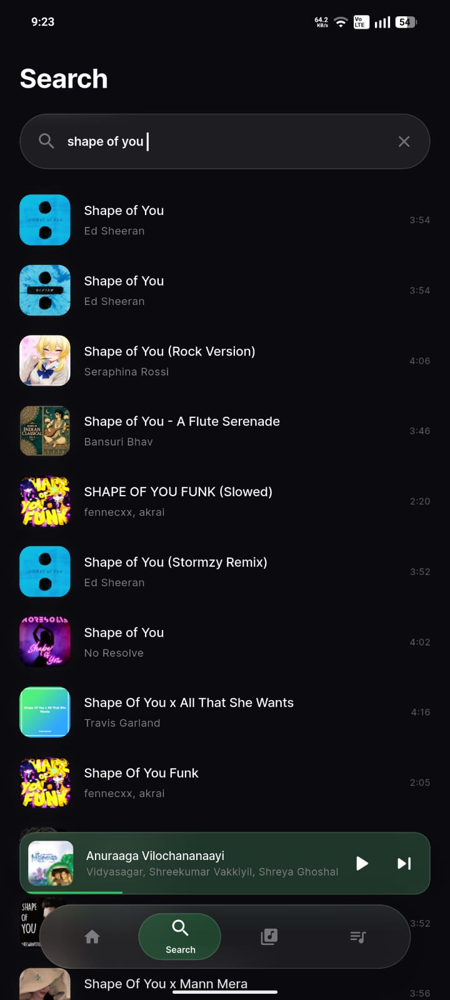
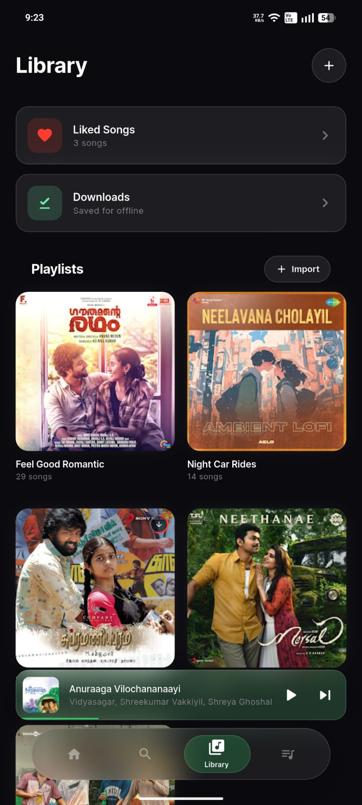
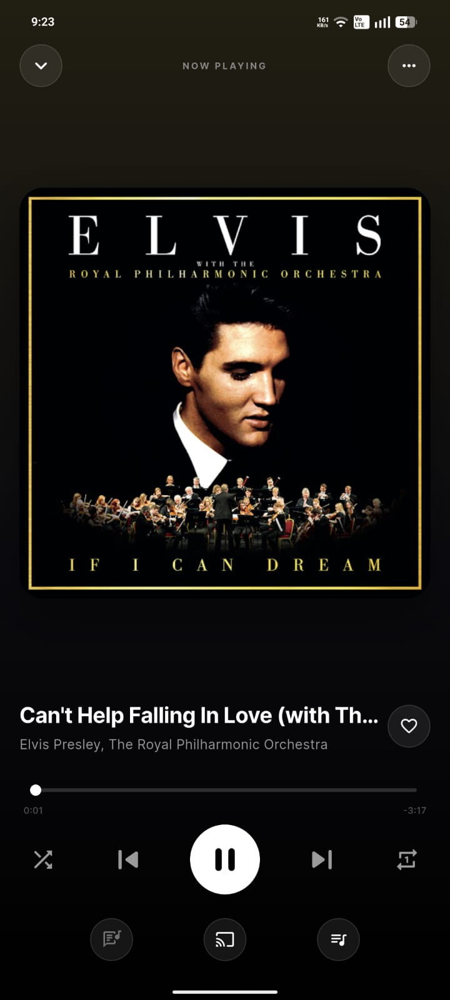
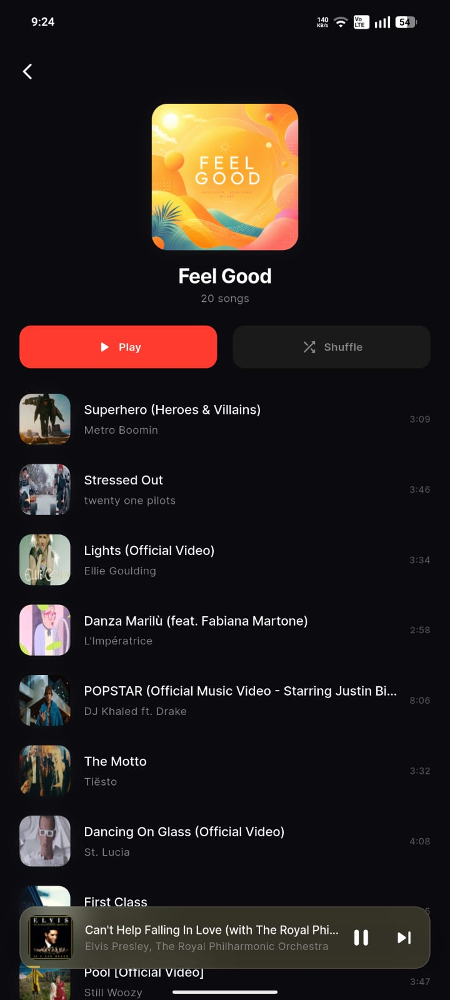
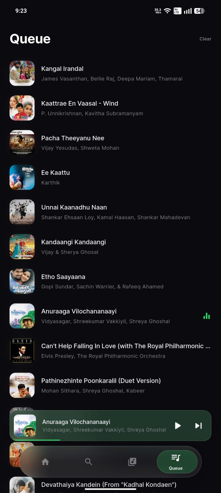

# Gravity Music

A premium Android music streaming app with dynamic album-driven visuals, a floating glassmorphism UI, personalized discovery, playlists, and an immersive Apple Music-inspired listening experience — built with Flutter and powered by YouTube as a streaming backend.

Gravity Music is the successor to **Saragama**, rebuilt from the ground up with a new design language, architecture, and feature set.



## Screenshots

<table>
  <tr>
    <td></td>
    <td></td>
    <td></td>
  </tr>
  <tr>
    <td align="center"><b>Home</b></td>
    <td align="center"><b>Search</b></td>
    <td align="center"><b>Library</b></td>
  </tr>
  <tr>
    <td></td>
    <td></td>
    <td></td>
  </tr>
  <tr>
    <td align="center"><b>Now Playing</b></td>
    <td align="center"><b>Playlist</b></td>
    <td align="center"><b>Queue</b></td>
  </tr>
</table>

## Features

- **Cinematic Dark UI** — obsidian glassmorphism design with floating navigation, a floating mini-player, and blurred translucent surfaces
- **Dynamic theming** — accent and background colors are extracted from the current track's artwork
- **Home** — recently played, personalized "Mixes" recommendations refreshed daily, and your playlists
- **Search** — search YouTube for any song, artist, or genre
- **Library** — liked songs, custom playlists, and offline downloads
- **Offline playlists** — download an entire playlist for offline listening in the background, with progress and completion badges on the playlist tile
- **Playlist import** — import playlists directly from Spotify or Apple Music links, running in the background while you keep listening
- **Now Playing** — full-screen player with synced lyrics, queue management, shuffle/loop, sleep timer, and streaming quality toggle
- **Background playback** — lock-screen and notification controls with high-resolution artwork, loudness normalization, and session restore across app restarts
- **Android Auto** — browse and play your playlists from the car
- **Offline-friendly caching** — resolved stream URLs, song downloads, home/playlist data are cached locally

## Tech Stack

- [Flutter](https://flutter.dev) (Dart) — Android primary target
- [GetX](https://pub.dev/packages/get) — state management
- [audio_service](https://pub.dev/packages/audio_service) + [just_audio](https://pub.dev/packages/just_audio) — background playback, lock-screen/notification integration
- [youtube_explode_dart](https://pub.dev/packages/youtube_explode_dart) — YouTube stream resolution
- [Hive](https://pub.dev/packages/hive) — local persistence (settings, cache, library)
- [palette_generator](https://pub.dev/packages/palette_generator) — dynamic color extraction from album art
- [lrclib.net](https://lrclib.net) — synced lyrics

## Getting Started

```bash
flutter pub get      # install dependencies
flutter run          # run on a connected device/emulator (Android)
flutter analyze      # static analysis
flutter build apk    # build a release APK
```

## Architecture

The playback stack is split into focused layers:

- **`MyAudioHandler`** — `audio_service`-facing layer (notification/lockscreen contract) and command bus for all playback operations
- **`PlaybackEngine`** — owns the `just_audio` player, playback state machine, loudness normalization, auto-advance
- **`QueueManager`** — pure-Dart queue navigation (shuffle, loop, prev/next)
- **`AutoplayOrchestrator`** — predictive queue refill via recommendations
- **`PlayerController`** — GetX controller exposing playback state to the UI, session save/restore, likes, search history, sleep timer
- **`LyricsController`** — fetches and syncs lyrics from lrclib.net

Stream URLs are resolved with a cache-first strategy (cached file → downloaded file → playlist-downloaded file → cached URL → fresh fetch via an isolate), modeled by `HMStreamingData`.
