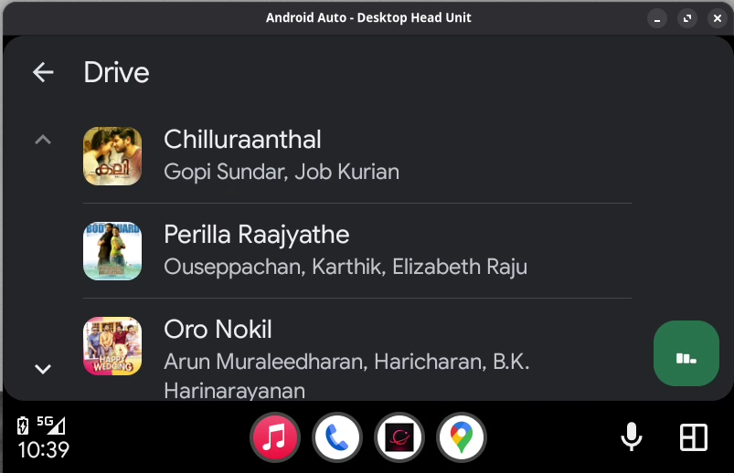

# Gravity Music

A premium music streaming app with dynamic album-driven visuals, a floating glassmorphism UI, personalized on-device discovery, playlists, and an immersive Apple Music-inspired listening experience — built with Flutter and powered by YouTube as a streaming backend. Runs on Android (primary target) and Linux/Windows desktop.


## Screenshots

<table>
  <tr>
    <td></td>
    <td></td>
    <td></td>
  </tr>
  <tr>
    <td align="center"><b>Home</b></td>
    <td align="center"><b>Search</b></td>
    <td align="center"><b>Library</b></td>
  </tr>
  <tr>
    <td></td>
    <td></td>
    <td></td>
  </tr>
  <tr>
    <td align="center"><b>Now Playing</b></td>
    <td align="center"><b>Playlist</b></td>
    <td align="center"><b>Queue</b></td>
  </tr>
</table>

### Android Auto

<table>
  <tr>
    <td></td>
    <td></td>
    <td></td>
  </tr>
  <tr>
    <td align="center"><b>In-car display</b></td>
    <td align="center"><b>Browse Playlists</b></td>
    <td align="center"><b>Map View</b></td>
  </tr>
</table>

### Desktop (Linux)

<table>
  <tr>
    <td></td>
    <td></td>
  </tr>
  <tr>
    <td align="center"><b>App</b></td>
    <td align="center"><b>System Media Controls (MPRIS)</b></td>
  </tr>
</table>

## Features

- **Cinematic Dark UI** — obsidian glassmorphism design with floating navigation, a floating mini-player, and blurred translucent surfaces
- **Dynamic theming** — accent and background colors are extracted from the current track's artwork
- **Home** — recently played, personalized "Mixes" generated on-device from your listening history (Artist Mixes, Discovery, Repeat Rewind, Throwbacks, Favorites), and your playlists
- **Search** — search YouTube Music for any song, artist, or genre
- **Library** — liked songs, custom playlists, and offline downloads
- **Offline playlists** — download an entire playlist for offline listening in the background, with progress and completion badges on the playlist tile
- **Playlist import** — import playlists directly from Spotify or Apple Music links, running in the background while you keep listening
- **Now Playing** — full-screen player with synced lyrics, queue management, shuffle/loop, sleep timer, and streaming quality toggle
- **Background playback** — lock-screen and notification controls with high-resolution artwork, loudness normalization, and session restore across app restarts
- **Android Auto** — browse and play your playlists from the car
- **Offline-friendly caching** — resolved stream URLs, song downloads, home/playlist data are cached locally
- **Cloud sync (optional)** — sign in with Google to back up and sync your liked songs and playlists across devices via Supabase; the app remains fully offline and account-free unless you opt in

## Tech Stack

- [Flutter](https://flutter.dev) (Dart) — Android primary; Linux/Windows desktop via media_kit
- [GetX](https://pub.dev/packages/get) — state management
- [audio_service](https://pub.dev/packages/audio_service) + [just_audio](https://pub.dev/packages/just_audio) — background playback, lock-screen/notification integration
- [just_audio_media_kit](https://pub.dev/packages/just_audio_media_kit) + [audio_service_mpris](https://pub.dev/packages/audio_service_mpris) — Linux/Windows audio backend and MPRIS system media integration
- [youtube_explode_dart](https://pub.dev/packages/youtube_explode_dart) — YouTube stream resolution
- YouTube Music `youtubei` API (on-device) — search, recommendations, radio/mixes with no external server
- [Hive](https://pub.dev/packages/hive) — local persistence (settings, cache, library, downloads, listening history)
- [palette_generator](https://pub.dev/packages/palette_generator) — dynamic color extraction from album art
- [lrclib.net](https://lrclib.net) — synced lyrics
- [supabase_flutter](https://pub.dev/packages/supabase_flutter) + [google_sign_in](https://pub.dev/packages/google_sign_in) — optional cloud sync and Google authentication

## Getting Started

```bash
flutter pub get           # install dependencies
flutter run               # run on a connected Android device/emulator
flutter run -d linux      # run on Linux desktop
flutter analyze           # static analysis
flutter test              # run the test suite
flutter build apk         # build a release APK
```

## Architecture

**All backend logic runs on-device** — search, recommendations, and mixes call YouTube Music's internal `youtubei` API directly; no external server is involved.

The playback stack is split into focused layers:

- **`MyAudioHandler`** — `audio_service`-facing layer (notification/lock-screen/MPRIS contract) and command bus for all playback operations
- **`PlaybackEngine`** — owns the `just_audio` player, playback state machine, loudness normalization, auto-advance
- **`QueueManager`** — pure-Dart queue navigation (shuffle, loop, prev/next)
- **`AutoplayOrchestrator`** — predictive queue refill via taste-profile-reranked recommendations
- **`PlayerController`** — GetX controller exposing playback state to the UI, session save/restore, likes, search history, sleep timer; records every play to `ListeningHistoryService`
- **`LyricsController`** — fetches and syncs lyrics from lrclib.net

Personalization:
- **`ListeningHistoryService`** — per-track play counts and timestamps powering the home mixes
- **`TasteProfile`** — on-device artist-affinity model (liked songs + play history) used to re-rank "up next" candidates
- **`MixesService`** / **`PersonalizedMixesService`** — generate "Made For You" mixes entirely on-device; new users get a seeded Discovery Mix so home is never empty

Stream URLs resolve cache-first: downloaded file (`file://`) → cached URL → fresh fetch via an isolate, modeled by `HMStreamingData`.

## Disclaimer

This project is a **personal, experimental app** built for learning and exploration. It is not intended for commercial use, monetization, or sale.

Gravity Music streams audio from **YouTube** using YouTube's internal APIs and [`youtube_explode_dart`](https://pub.dev/packages/youtube_explode_dart). It does not host, store, or redistribute any audio or video content — all media is served directly from YouTube's CDN in real time, the same way a browser would.

Use of this app may be subject to [YouTube's Terms of Service](https://www.youtube.com/t/terms). The author takes no responsibility for any ToS implications, misuse, or legal issues arising from the use of this software. **Use at your own risk.**
